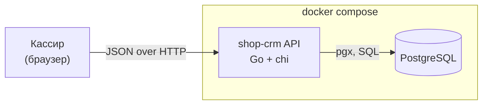
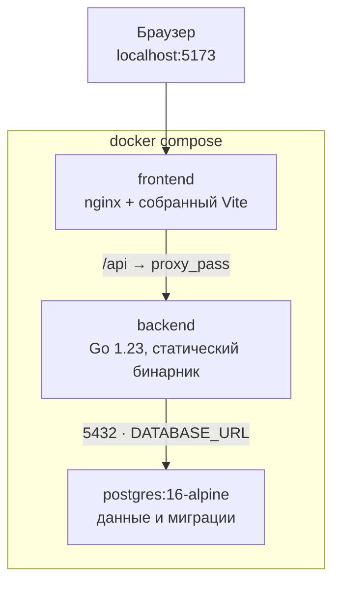
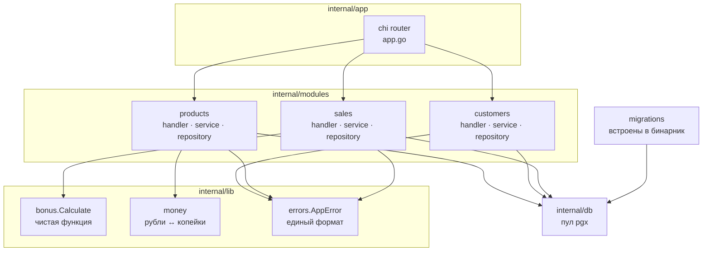
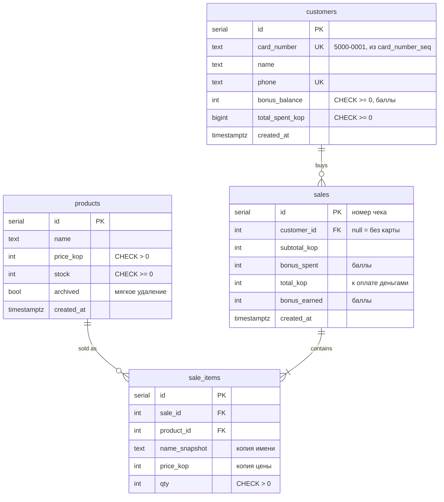
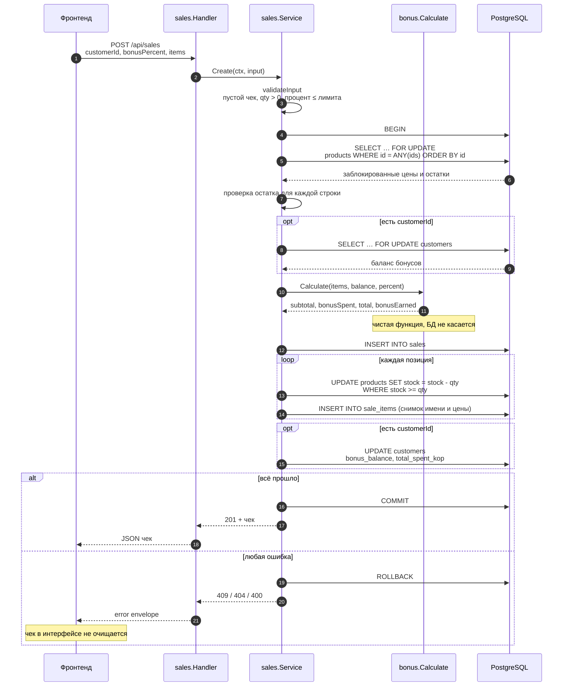
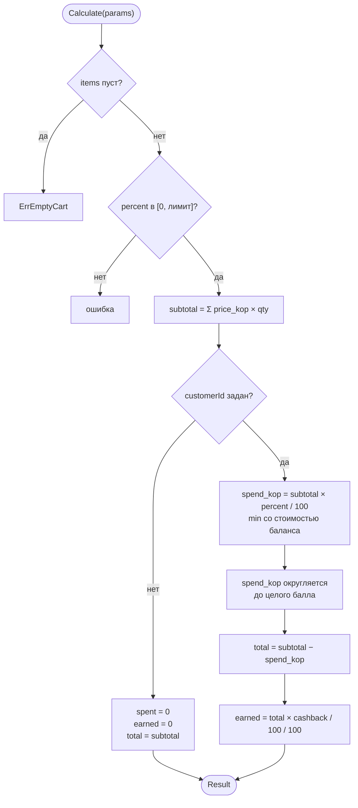
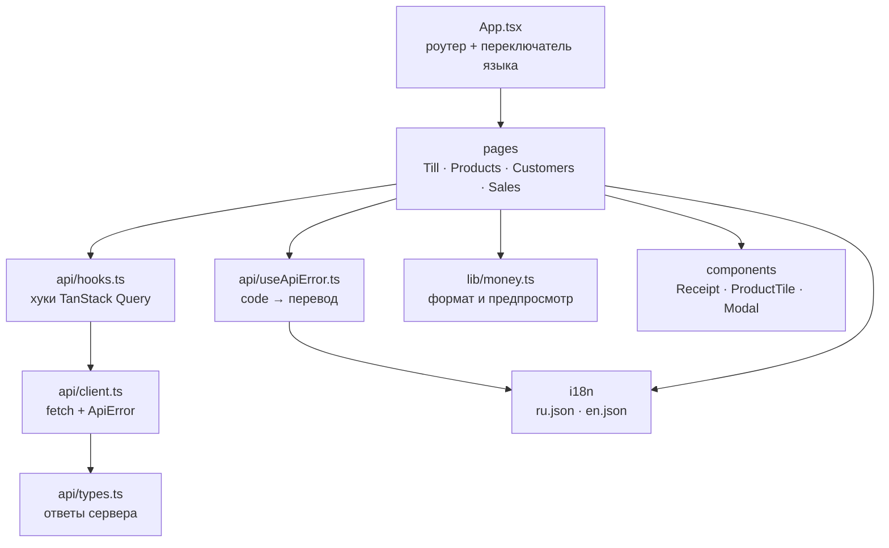
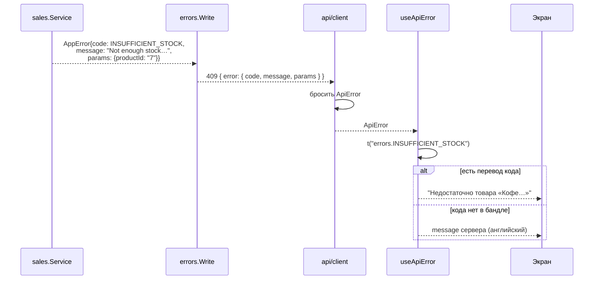
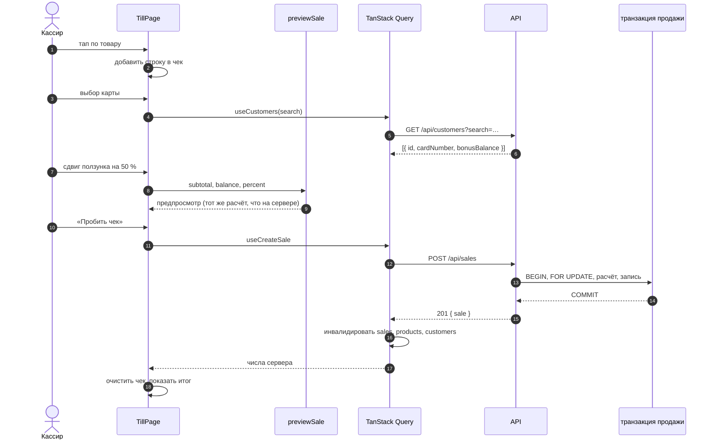
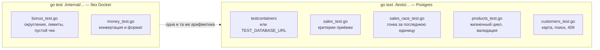

# Архитектура / Architecture

Диаграммы к проекту shop-crm. Каждая подписана: что показывает и где в коде ей
соответствует.

> English diagrams and notes live in the same file; section headings are bilingual.

## 1. Контекст системы

Магазин работает в браузере кассира. Авторизации в MVP нет: один пользователь, один
компьютер, одна точка входа.

Источник: `docker-compose.yml`, `shop-crm/backend/cmd/api/main.go`.

## 2. Контейнеры и их зоны ответственности

Ключевое: nginx проксирует `/api` на backend, поэтому в проде всё одноorigin и CORS
не участвует. В разработке Vite проксирует `/api` на `localhost:8080`.

Источник: `docker-compose.yml`, `frontend/nginx.conf`, `frontend/vite.config.ts`.

## 3. Слои бэкенда

Модули не знают друг о друге: общий доступ только через SQL и маршруты в `app`.

`handler` разбирает HTTP и пишет ошибки, `service` валидирует и применяет правила,
`repository` выполняет SQL. Правило одно: только `service` знает про бизнес-правила,
только `repository` — про SQL.

## 4. Схема данных

Деньги — целые числа в копейках. Инварианты продублированы в `CHECK`, чтобы они
держались даже при ошибке в коде.

Две вещи, ради которых схема такая:

- `sale_items.name_snapshot` и `sale_items.price_kop` — снимок на момент продажи. Смена
  цены товара не переписывает историю чеков.
- `products.archived` — мягкое удаление. Строка остаётся, и старые чеки продолжают
  ссылаться на реальный товар.

Номер карты выдаёт последовательность `card_number_seq`, а не разбор максимума: первый
вариант ломался, как только в таблице появлялась карта с другим префиксом.

Источник: `backend/migrations/000001_init.up.sql`, `000002_seed.up.sql`.

## 5. Транзакция `POST /api/sales`

Самая важная последовательность в проекте. Блокировки идут в порядке `id`, иначе две
параллельные продажи, пересекающиеся по двум товарам, упираются в deadlock.

Проверка остатка сделана дважды: в Go по заблокированным значениям и в `WHERE`
обновления. Если между чтением и записью состояние строки изменится, обновление
станет no-op, а транзакция откатится.

Источник: `backend/internal/modules/sales/service.go`, `repository.go`.

## 6. Расчёт чека

Единственное место, где живут правила бонусной программы. Функция чистая: без БД, без
часов, без случайных чисел.

Два округления, оба вниз, и оба важны:

- `spend_kop` округляется до целого балла, чтобы `total` всегда равнялся
  `subtotal − bonusSpent × 100`. Частичный балл остаётся у покупателя, деньги не
  исчезают.
- `earned` округляется вниз: магазин не начисляет обещанного лишнего.

Кэшбэк считается от суммы, **реально оплаченной деньгами**, а не от суммы чека. Если
чек на 1000 ₽ закрыт наполовину бонусами, начисляется 25 баллов, а не 50.

Источник: `backend/internal/lib/bonus/bonus.go`, тесты в `bonus_test.go`.

## 7. Фронтенд

`lib/money.ts` дублирует арифметику бэкенда, чтобы чек на кассе не «прыгал», пока
пользователь собирает его. Это предпросмотр, а не источник истины: после `POST /sales`
интерфейс показывает числа из ответа сервера.

## 8. Локализация ошибок

Ошибка доезжает до экрана двумя дорогами: стабильный код и английский текст.

`params` несут контекст, которого нет в тексте: `productId` позволяет подставить
название товара из уже загруженного каталога. Названия всех кодов перечислены в
`errors.*` обоих бандлов.

Источник: `frontend/src/api/useApiError.ts`, `backend/internal/lib/errors/errors.go`,
ADR `docs/decisions/0003-localisation-strategy.md`.

## 9. Поток запроса целиком

Пример: кассир пробивает чек с картой и ползунком бонусов на 50 %.

При 409 чек остаётся на экране: кассир правит его, а не собирает заново.

## 10. Потоки тестов

Расчёт чека покрыт юнит-тестами без БД, а интеграционные проверяют то, что юнит-тесты
не видят: транзакцию, блокировки и HTTP-контракт.
